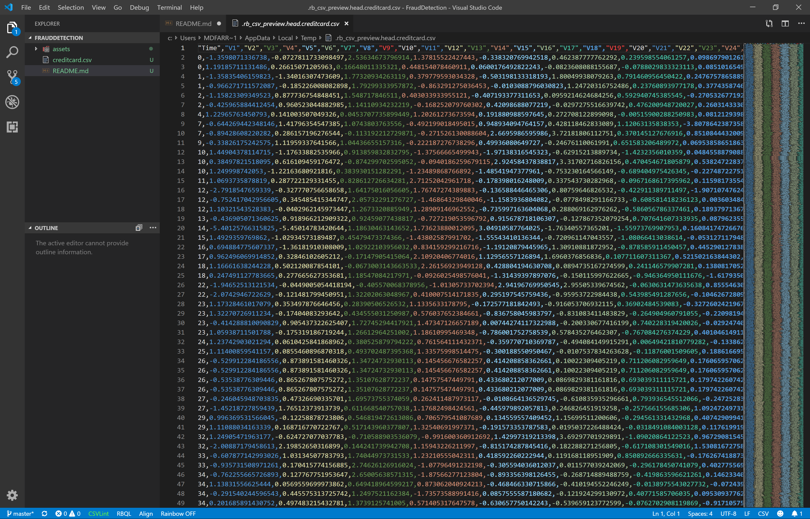

# The case

It is very important that credit card companies are able to recognize fraudulent credit card transactions so that customers are not charged for items that they did not purchase.

Credit card fraud happens a lot. During two days in September 2013 in Europe, credit card networks recorded at least 492 fraud cases out of a total of 284,807 transactions. That's 246 fraud cases per day!

In this case study, you're going to help credit card companies detect fraud in real time. You will train a classification model on detected fraud cases, and then test your predictions on a new set of transactions. 

How accurate will your app be? Do you think you will be able to detect financial fraud in real time? 

Let's find out! 

# The dataset

In this case study you'll be working with a SEPA dataset containing transactions made by European credit card holders in September 2013. This dataset covers transactions that occurred in two days, where we have 492 frauds out of 284,807 transactions. 

Note that the dataset is highly unbalanced, the positive class (frauds) account for only 0.172% of all transactions.

The data set contains 285k records, 30 feature columns, and a single label indicating if the transaction is fraudulent or not. You can use any combination of features you like to generate your fraud predictions.

There is a single file in the dataset:
* [creditcard.csv](https://www.kaggle.com/mlg-ulb/creditcardfraud/downloads/creditcard.csv/3) which contains 285k records, 30 input features, and one output label. You will use this file to train and test your model.

The file is about 150 MB in size. You'll need to [download it from Kaggle](https://www.kaggle.com/mlg-ulb/creditcardfraud/downloads/creditcard.csv/3) to get started. [Create a Kaggle account](https://www.kaggle.com/account/login) if you don't have one yet. 

Here's a description of all 31 columns in the data file:
* Time: the number of seconds elapsed between this transaction and the first transaction in the dataset
* V1-V28: a specific feature of the transaction, transformed to a number to protect user identities and sensitive information
* Amount: the transaction amount
* Class: 1 for fraudulent transactions or 0 for normal transactions

# Your assignment
Your assignment is to build a pipeline that loads the data file and trains a binary classification model using the V1-V28 columns. 

You can select any of the 28 input features you like, and you can perform any kind of data processing you like on the columns. 

Train a binary classifier on the data and generate predictions for all the transactions in the test set. 

Evaluate your model and decide which metrics you're going to use. Make sure to include the **AUC** too. Report your best results in our Slack group.

See if you can get the AUC as close to 1 as possible. Share in our group how you did it. Which features did you select, how did you process them, and how did you configure your model? 

Good luck!
