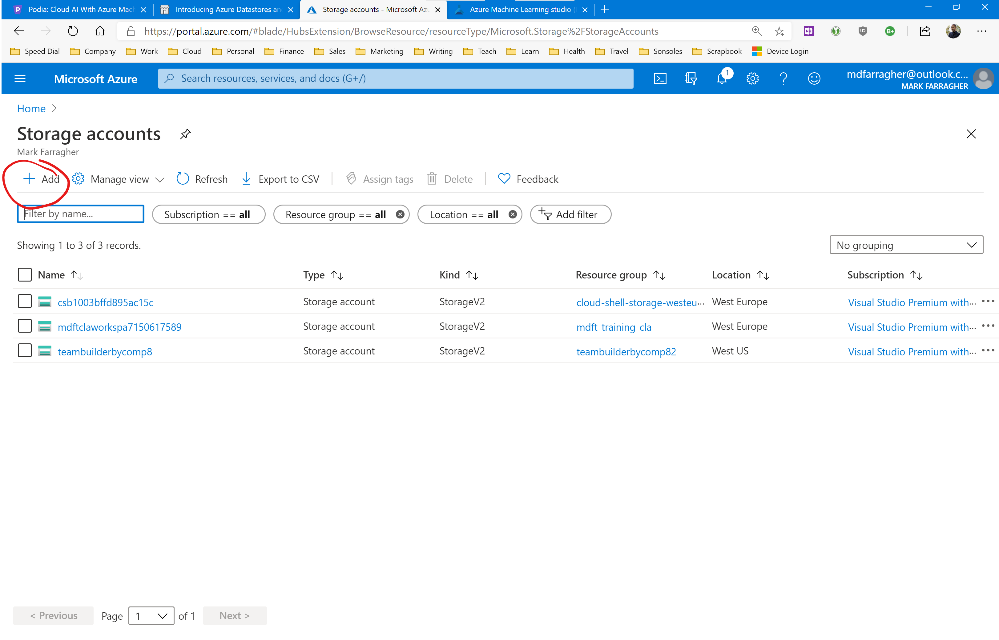
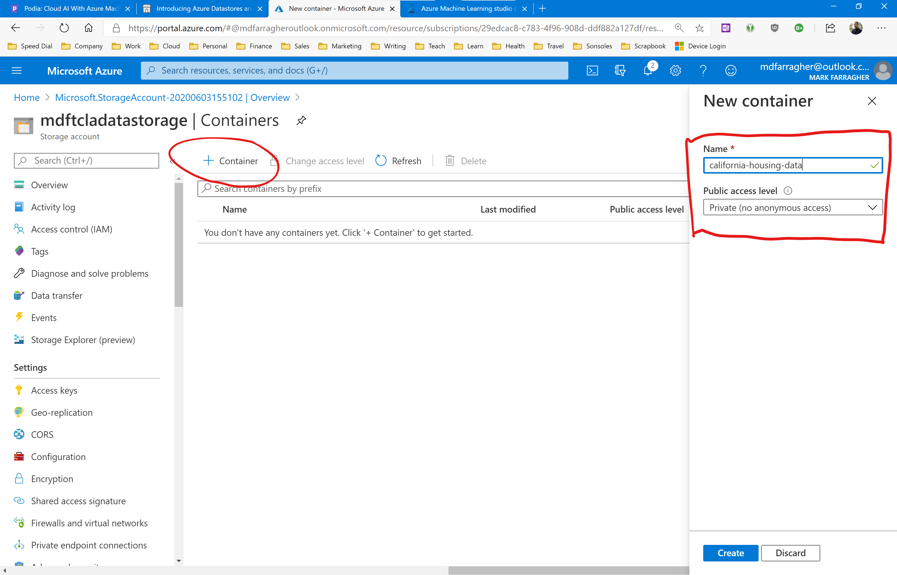

# Assignment: Create the California Housing dataset

In this assignment you're going to load a dataset with the prices of houses in California into Azure. The data is not ready for training yet and needs a bit of preprocessing. 

The first thing you'll need is a data file with house prices. The data from the 1990 California cencus has exactly what we need. 

Download the [California 1990 housing census](https://github.com/mdfarragher/DSC/blob/master/LoadingData/CaliforniaHousing/california_housing.csv) and save it. 

This is a CSV file with 17,000 records that looks like this:
 

The file contains information on 17k housing blocks all over the state of California:

* Column 1: The longitude of the housing block
* Column 2: The latitude of the housing block
* Column 3: The median age of all the houses in the block
* Column 4: The total number of rooms in all houses in the block
* Column 5: The total number of bedrooms in all houses in the block
* Column 6: The total number of people living in all houses in the block
* Column 7: The total number of households in all houses in the block
* Column 8: The median income of all people living in all houses in the block
* Column 9: The median house value for all houses in the block

We will load this data into Azure Machine Learning so that we can use the dataset later in the upcoming assignments.

## Before You Start

Make sure you have set up your Azure Machine Learning Workspace by following the instructions in the previous assignments.  

## Create an Azure Storage Account

Let's get started. Your first task is to set up an Azure Storage Account to hold all the data we're going to be using in this course. 

Go to your Azure portal page at https://portal.azure.com/. Click on the search field in the top blue bar and search for "storage accounts". Click on the Storage Accounts link in the search dropdown.

You'll be taken to the Azure Storage Accounts page. Click on the Add button in the top left of the page:

We're going to create a simple storage account to hold all our machine learning data. Provide the following information:

* The resource group in which to place the storage account. Select the same resource group that is currently holding your Azure Machine Learning workspace.
* The storage account name.
* The location in which to place the storage account. Use the same location as where your Azure Machine Learning workspace is located.
* The performance level. Set this to Standard to save money.
* Account kind. Set this to General Purpose v2. 
* Replication. Set this to Locally-Redundant Storage (LRS).
* Access tier. Set this to Hot. 

Click the blue Review+Create button to confirm your choices and then click the blue Create button to create the storage account. This will take up to a minute. 

When the deployment confirmation appears, click on the Go To Resource button to navigate to the overview page of your new storage account. 

The page should look like this:

Now click on the Containers link. You'll see an empty list of containers. Click the +Container button and provide the following information:

* The name of the container to create. Fill in "california-housing-data" here.
* The access level of the container. Set this to Private.

Click the blue Create button to confirm your choices and create the new container.

When the container appears in the list, click on it. Then click the Upload button to upload the California Housing datafile into the container. See the image below for the correct sequence of steps. And don't forget to click the Upload button at the end to start the upload. 

You now have a new storage account with a data container that holds the California Housing data. We are ready to bring this data into the Azure Machine Learning Workspace.

## Create an Azure ML Datastore

We're now going to make the new storage account available in the Azure Machine Learning workspace as a datastore.

Open the Azure Machine Learning Studio web interface and click on the Datastores link in the menu on the left. You'll see the datastores overview page which will look like this:

Click on the +New Datastore link to create a new datastore. Provide the following information:

* The name of the datastore to create. Fill in "california_housing_data".
* The datastore type. Select Azure Blob Storage.
* The account selection method. Select From Azure Subscription.
* The storage account to use. Select the account that you just created in the previous step. 
* The blob container to load data from. Select the container that you just created in the previous step.
* Authentication type. Set this to Account Key.

We have one field remaining, which is the Account Key. This is the secret key (much like a password) that provides access to the storage account. 

To get the key, leave this webpage open and now open a new browser tab. Go to the Azure portal (https://portal.azure.com/) and navigate to your storage account.

Now in the menu on the left, click on Access Keys. You'll see a page with two keys, key 1 and key 2. You can use either of these keys to set up the datastore. In the screenshot I have highlighted key 1:

Now copy this key, switch to the other browser tab, and enter the key in the final field of the New Datastore panel. Then click the blue Create button to set up the datastore.

You'll see a message that the datastore was successfully created, and it will appear in the list of stores:

## Create an Azure ML Dataset

-------------- TOT HIER --------------

Now that you have some compute resources that you can use to process data, you'll need a way to store and ingest the data to be processed.

1. In the *Studio* interface, view the **Datastores** page. Your Azure ML workspace already includes two datastores based on the Azure Storage account that was created along with the workspace. These are used to store notebooks, configuration files, and data.

   > **Note**: In a real-world environment, you'd likely add custom datastores that reference your business data stores - for example, Azure blob containers, Azure Data Lakes, Azure SQL Databases, and so on. You'll explore this later in the course.

2. In the *Studio* interface, view the **Datasets** page. Datasets represent specific data files or tables that you plan to work with in Azure ML.
3. Create a new dataset from web files, using the following settings:
    * **Basic Info**:
        * **Web URL**: https://aka.ms/diabetes-data
        * **Name**: diabetes dataset (*be careful to match the case and spacing*)
        * **Dataset type**: Tabular
        * **Description**: Diabetes data
    * **Settings and preview**:
        * **File format**: Delimited
        * **Delimiter**: Comma
        * **Encoding**: UTF-8
        * **Column headers**: Use headers from first file
        * **Skip rows**: None
    * **Schema**:
        * Include all columns other than **Path**
        * Review the automatically detected types
    * **Confirm details**:
        * Do not profile the dataset after creation
4. After the dataset has been created, open it and view the **Explore** page to see a sample of the data. This data represents details from patients who have been tested for diabetes, and you will use it in many of the subsequent labs in this course.

    > **Note**: You can optionally generate a *profile* of the dataset to see more details. You'll explore datasets in more detail later in the course.

