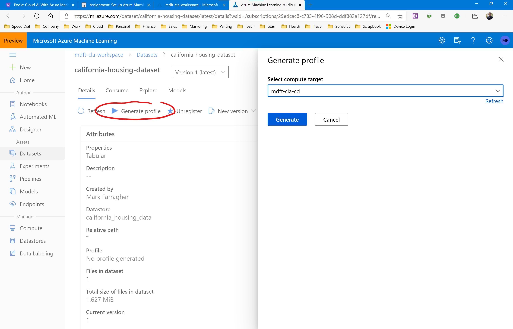
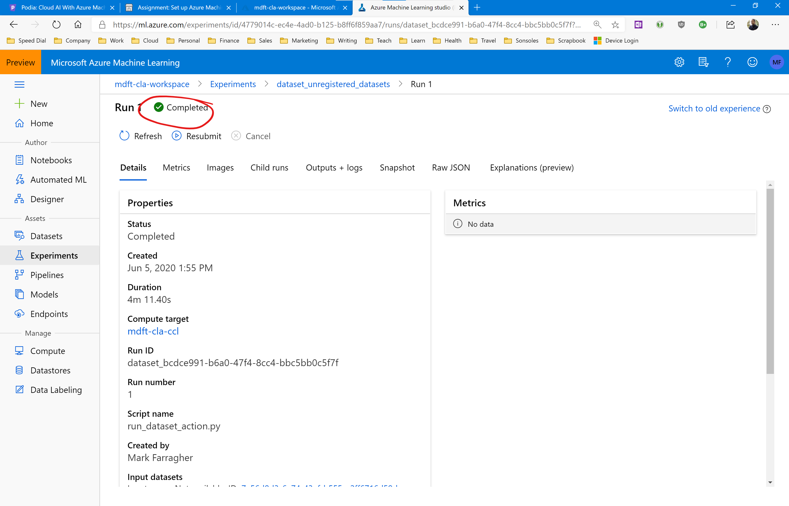

# Assignment: Profile the California Housing dataset

In this assignment you're going to profile the California Housing dataset and analyze the individual columns to discover which ones may need additional processing before we can start training a machine learning model.  

Just to refresh your memory, the dataset contains information on 17k housing blocks all over the state of California. Each record contains the following columns of information:

* Column 1: The longitude of the housing block
* Column 2: The latitude of the housing block
* Column 3: The median age of all the houses in the block
* Column 4: The total number of rooms in all houses in the block
* Column 5: The total number of bedrooms in all houses in the block
* Column 6: The total number of people living in all houses in the block
* Column 7: The total number of households in all houses in the block
* Column 8: The median income of all people living in all houses in the block
* Column 9: The median house value for all houses in the block

We are going to analyze each column, calculate value distributions, and identify any heavily-skewed columns that may need additional processing.

## Before You Start

Make sure you have set up the California Housing dataset by following the instructions in the previous assignments.  

## Profile the California Housing dataset

Let's get started. Navigate to the dataset overview page and select the California Housing dataset. Then, in the dataset overview page, click on the Generate Profile button. 

You'll need to specify which compute cluster to use to generate the profile. We have only configured a single 2-vm cluster, so select that cluster from the dropdown list. Then click the blue Generate button to start the run.

After a couple of seconds you'll find yourself back in the dataset overview page, with a green notification banner indicating that profile generation has started.

Click the link in the banner to view the generation job status while it's running. 

Every time you generate a profile for a dataset, Azure Machine Learning will create a new **experiment** to track progress and store the results. We will discuss Azure Machine Learning Experiments in detail in a later lesson.

For now, keep an eye on the run status in the top left of the page. You can click the Refresh button periodically to update the page and check if the experiment has concluded.

Generating a full profile takes a couple of minutes. The experiment needs to be set up, transferred to the compute cluster, executed there, and the results need to be collected. This entire process can take 5-10 minutes.

For relatively small data files like the California housing dataset this process is a bit overkill. But keep in mind that profile generation will work for datasets of any size, up to multiple terabytes of data.

Eventually the experiment will complete, and the status in the top left of the page will read: Completed.

You cannot view the profile from the experiment. Instead, go back to the datasets overview page and select the California housing dataset. 

Then click on the Explore tab and select the Profile sub-tab. You will now see the complete profile based on all 17,000 records in the dataset.

Note that the Count column in the profile correctly shows 17,000 values for every data column.

Now take a look at each column. What do you think of the quality of this dataset? Are all the columns ready for machine learning training?

See if you can answer the following questions:

* Which columns do not need further processing and are ready for machine learning training?
* Which columns need to be scaled to bring their numeric range in line with the other columns in the dataset?
* Look at the Min and Max values for each column. Do you see anything weird?
* Which columns have many outliers trailing their normal distribution? 
* How would you process these outliers?

To complete this assignment, describe how you would process the data columns in the California Housing dataset to prepare for machine learning training. Explain how you would process each column, and share your conclusions in our Slack homework group. 
