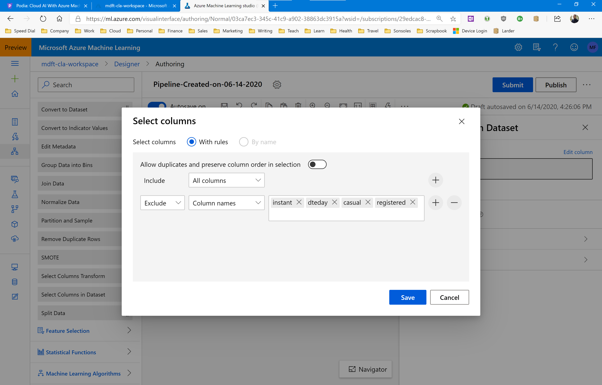
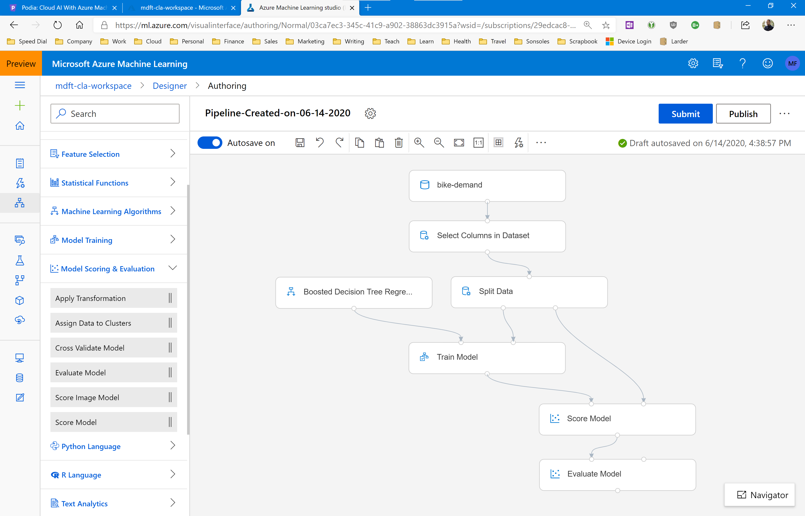

# Assignment: Predict bike sharing demand in Washington DC

In this assignment you're going to build a pipeline that can predict bike sharing demand in Washington DC.

A bike-sharing system is a service in which bicycles are made available to individuals on a short term. Users borrow a bike from a dock and return it at another dock belonging to the same system. Docks are bike racks that lock the bike, and only release it by computer control.

You’ve probably seen docks around town, they look like this:

Bike sharing companies try to even out supply by manually distributing bikes across town, but they need to know how many bikes will be in demand at any given time in the city.

So let’s give them a hand with a machine learning model!

You are going to train a forest of regression decision trees on a dataset of bike sharing demand. Then you’ll use the fully-trained model to make demand predictions and test the accuracy of your model.

The first thing you will need is a data file with lots of bike sharing demand numbers. We are going to use the [UCI Bike Sharing Dataset](http://archive.ics.uci.edu/ml/datasets/bike+sharing+dataset) from [Capital Bikeshare](https://www.capitalbikeshare.com/) in Metro DC. This dataset has 17,380 bike sharing records that span a 2-year period.

[Download the dataset](https://github.com/mdfarragher/DSC/blob/master/Regression/BikeDemandPrediction/bikedemand.csv) and upload it to your Azure Machine Learning workspace as a new dataset.

The file looks like this:

It’s a comma-separated file with 17 columns:

* Instant: the record index
* Date: the date of the observation
* Season: the season (1 = springer, 2 = summer, 3 = fall, 4 = winter)
* Year: the year of the observation (0 = 2011, 1 = 2012)
* Month: the month of the observation ( 1 to 12)
* Hour: the hour of the observation (0 to 23)
* Holiday: if the date is a holiday or not
* Weekday: the day of the week of the observation
* WorkingDay: if the date is a working day
* Weather: the weather during the observation (1 = clear, 2 = mist, 3 = light snow/rain, 4 = heavy rain)
* Temperature : the normalized temperature in Celsius
* ATemperature: the normalized feeling temperature in Celsius
* Humidity: the normalized humidity
* Windspeed: the normalized wind speed
* Casual: the number of casual bike users at the time
* Registered: the number of registered bike users at the time
* Count: the total number of rental bikes in operation at the time

You can ignore the record index, the date, and the number of casual and registered bikes, and use everything else as input features. The final column **Count** is the label you're trying to predict.

## Building the regression pipeline

Start by uploading the datafile into Azure. Make sure to specify that it's a tabular dataset and verify that the tab separator character is correctly detected, and that all the column datatypes are correct.

Then create a new pipeline in the Azure Machine Learning designer and drag the bike demand dataset module onto your pipeline canvas.

Open the Data Transformation panel and drag the Select Columns In Dataset module onto the pipeline canvas. Connect it to the dataset module.

Click the Select Columns In Dataset module and in the information panel on the right, configure the Select Columns field as follows:

This will include all dataset columns *except* instant, dteday, casual, and regular. This leaves only valid input features to train on. 

Now continue the pipeline in the usual manner. Split the data 80/20 and use the 80% set for training. 

Make sure you use the Boosted Decision Tree Regression algorithm for training the model. This is a boosted ensemble of regression decision trees.

Configure the algorithm as follows:

* Create Trainer Mode: SingleParameter
* Maximum number of leaves per tree: 20
* Minimum number of samples per leaf node: 10
* Learning rate: 0.2
* Total number of trees constructed: 100
* Random number seed: 123

Now score the model with the 20% test set and then evaluate the scored predictions to calculate performance metrics.

Your completed pipeline should look like this:

That's it, you are done.

Run the pipeline in a new experiment, and check out the evaluation results after the run has completed.

## Your results

What results do you get? What are your RMSE and MAE values? Is this a good result? 

Now take a look at the hyperparameters. Try to change the behavior of the ensemble learning algorithm and see what happens to the accuracy of your model. Did your model improve or get worse? 

Share your results in our Slack group!
